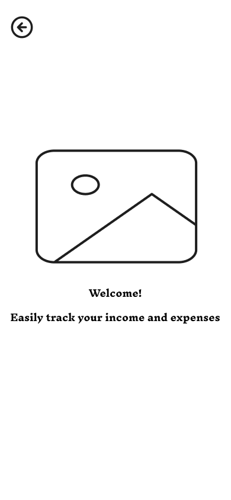
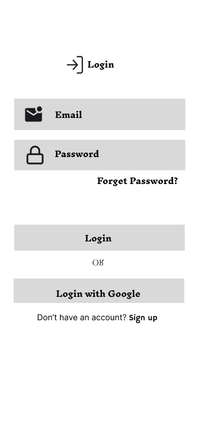
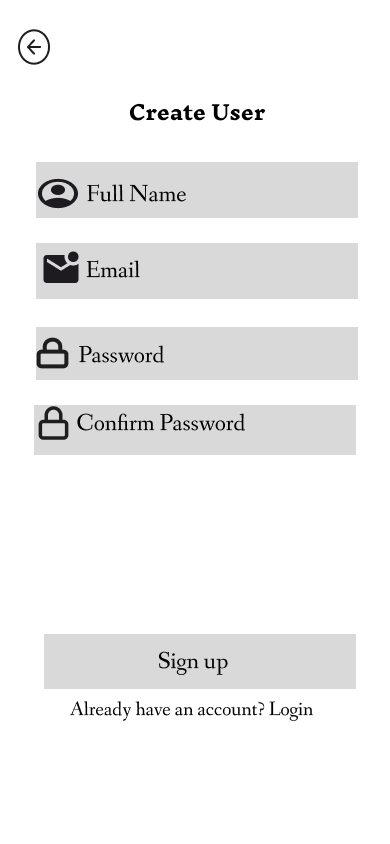
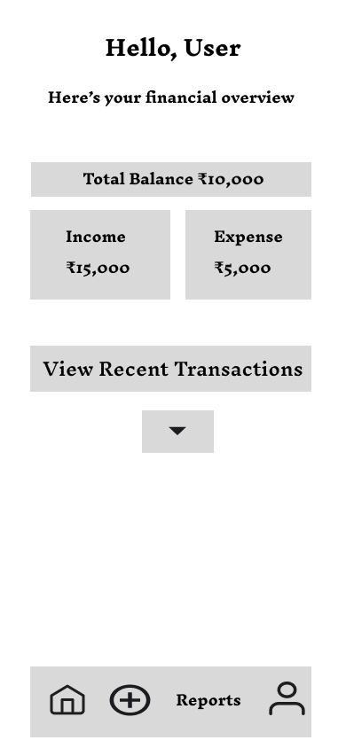
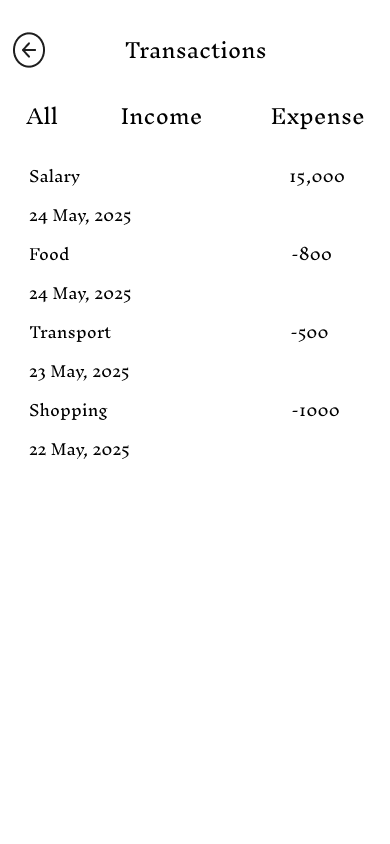
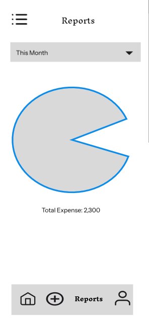
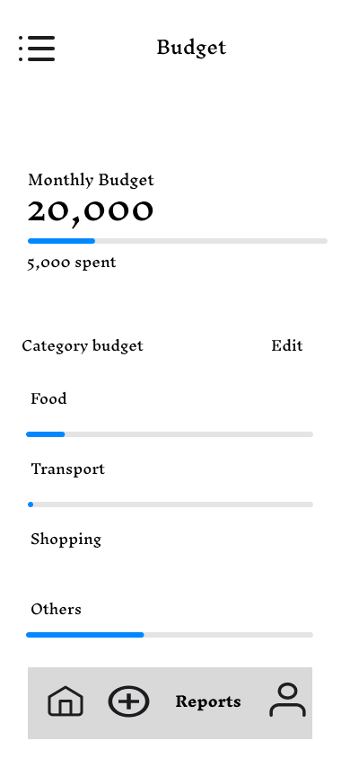
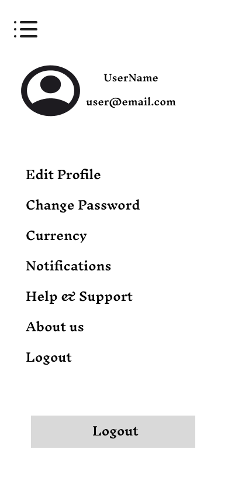
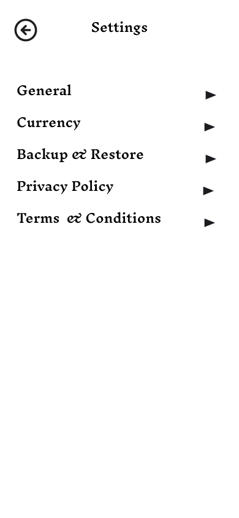
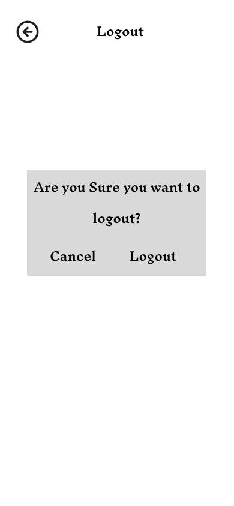

# 📱 Personal Expense Tracker – Low-Fidelity Wireframes

## 🧠 Problem Statement

Managing daily expenses is a common challenge, especially for students and young professionals. Users often lose track of small, frequent expenses, leading to poor financial planning. There is a need for a simple and intuitive mobile application to track and manage expenses efficiently.

---

## 🔍 User Research

Basic user research was conducted through informal surveys and discussions with students.

### Key Findings:

* Users frequently forget to record daily expenses
* Existing apps feel too complex for quick usage
* Users prefer simple interfaces with minimal steps
* Visual summaries (charts/reports) help understand spending

---

## 👤 User Persona

**Name:** Ananya
**Age:** 20
**Occupation:** College Student

**Goals:**

* Track daily expenses بسهولة
* Stay within a monthly budget
* View spending summaries

**Pain Points:**

* Forgetting small expenses
* Difficulty in managing money manually
* Confusing financial apps

---

## 🔄 User Flow

Splash Screen
⬇
Onboarding
⬇
Login / Sign Up
⬇
Home Dashboard
⬇
Add Expense
⬇
View Transactions
⬇
Reports / Budget
⬇
Profile / Settings

---

## 🧩 Wireframes

### Splash Screen

### Onboarding

### Login

### Sign Up

### Home Dashboard

### Add Expense

### Transactions

### Reports

### Budget

### Profile

### Settings

### Logout

---

## 🧠 Design Thinking Process

### 1. Empathize

Understood user difficulties in tracking daily expenses through basic research.

### 2. Define

Users need a simple, fast, and intuitive way to record and monitor expenses.

### 3. Ideate

Planned key features:

* Add expense quickly
* View transaction history
* Analyze spending using reports
* Manage user profile and settings

### 4. Prototype

Created low-fidelity wireframes to visualize app structure and flow.

### 5. Test

Wireframes were reviewed for clarity, simplicity, and usability. Improvements can be made based on user feedback.

---

## 🛠️ Tools Used

* Figma (for wireframing)

---

## 🎯 Expected Outcome

This project demonstrates early-stage design planning, including user research, persona creation, user flow design, and low-fidelity wireframing. It highlights the importance of understanding user needs before developing a full application.

---

## 📌 Conclusion

The wireframes provide a clear structure of the mobile application and ensure a user-friendly experience. This foundation can be further enhanced into high-fidelity designs and full application development.

